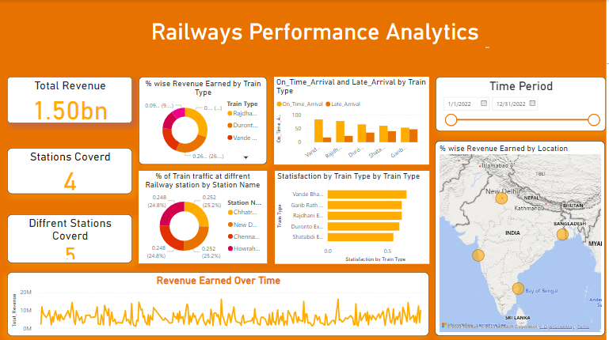

# Railway Data analysis
## Data Modelling
## Design Calendar Dimension
### Designing of Measures:
1. On-Time Arrival
2. Late Arrival
3. Revenue Earned
### % of Revenue Earned by different train types % of Train Traffic at different Railway Stations % of Revenue Earned Location wise
Satisfaction by Train Type
## Data Visualization
1. KPI (Total Revenue Earned, Different Train Types, Total Stations Covered)
2. Maps (% of Revenue Earned Location wise)
3. Pie/Donut Chart (% of Revenue Earned by different train types, % of Train Traffic at different Railway Stations)
4. Line Chart (Revenue Earned over Time)
5. Column Chart (On-Time vs Late Arrival by Train Type)
6. Bar Chart (Satisfaction by train type)
7. Filter (Period)

